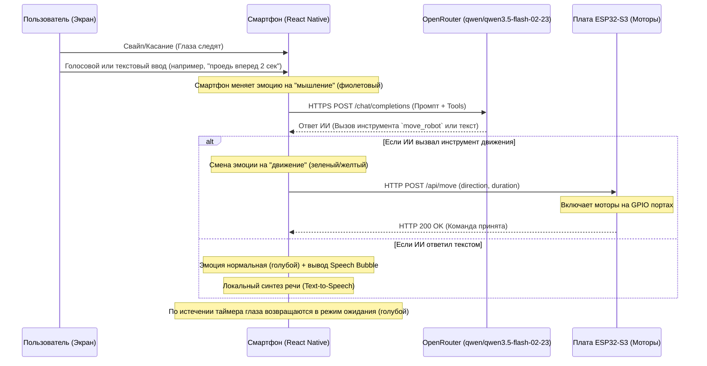

# ИИ-Робот (Edge AI Architecture MVP)

Проект интерактивного мобильного робота-компаньона BIBO Robot App, сочетающего искусственный интеллект, голосовое общение, эмоциональное лицо на экране смартфона и физическое шасси на базе микроконтроллера ESP32.

---

## Часть 1. О проекте

Робот функционирует по распределенной схеме **Edge AI**, разделяя сложные вычисления (логика, распознавание, синтез речи) и низкоуровневое управление железом (моторы, сенсоры).



### Зачем нужна распределенная схема?
1. **Экономия ресурсов ESP32**: Микроконтроллеры имеют жесткие ограничения по оперативной памяти (RAM) и вычислительной мощности. На них неэффективно поднимать тяжелое SSL/TLS шифрование для HTTPS, парсить огромные JSON-ответы от ИИ и синтезировать аудио.
2. **Смартфон как вычислительный хаб**: Телефон обладает быстрым процессором, постоянным подключением к интернету, встроенными библиотеками распознавания/синтеза речи, а также OLED-экраном высокого разрешения для рендеринга эмоций.
3. **Локальный контроллер**: ESP32 работает как быстрый, легковесный веб-сервер в локальной Wi-Fi сети. Он просто слушает команды смартфона и мгновенно дергает GPIO пины моторов.

---

## Часть 2. Что сделано и уже работает

На текущий момент в MVP реализован следующий функционал:

* **Интерактивное лицо (Робот-эмодзи)**: 
  - Набор выразительных глаз, которые автоматически моргают и следят за пальцем при касании экрана.
  - Динамическое изменение цвета окантовки и зрачков в зависимости от состояния робота (ожидание, движение, размышление, остановка).
* **Голосовой ввод (Speech-to-Text)**:
  - Удобный ввод команд по зажатию кнопки микрофона 🎙️.
  - Автоматическая транскрипция речи на русском языке, вывод текста на экран и мгновенная отправка к ИИ.
  - Поле ввода автоматически очищается после успешной отправки запроса.
* **Локальный голосовой ответ (Text-to-Speech)**:
  - Робот научился говорить! Ответы от ИИ озвучиваются прямо на смартфоне на русском языке с помощью системного TTS-движка (`expo-speech`).
  - Реализован «роботизированный» милый тембр голоса (`pitch: 1.05`).
* **Умное прерывание речи**:
  - Если робот начал говорить длинную фразу, но вы перебили его (зажали микрофон, отправили новый текст или нажали на кнопку джойстика) — текущая речь мгновенно останавливается, не создавая «каши».
* **Интерфейс удаленного управления**:
  - Всплывающий пульт ручного управления (джойстик 🕹️) для ручного перемещения робота (вперед, назад, стоп).
* **Панель конфигурации и отладки**:
  - Удобный оверлей настроек ⚙️ для конфигурации API-ключа OpenRouter и IP-адреса платы ESP32.
  - Возможность включить/выключить озвучку ответов (тумблер TTS).
  - Интегрированный интерактивный терминал, выводящий цветные логи запросов и ответов в реальном времени (отправлено, получено, ошибки сети, статус ESP32).

---

## Часть 3. Технические моменты

### 1. Спецификация API взаимодействия

#### Запрос к OpenRouter API
Смартфон отправляет промпт пользователя модели `qwen/qwen-2.5-72b-instruct` и передает описание доступных робототехнических инструментов (инструмент `move_robot`):
* **Эндпоинт**: `https://openrouter.ai/api/v1/chat/completions`
* **Формат инструментов (Tools)**:
```json
[
  {
    "type": "function",
    "function": {
      "name": "move_robot",
      "description": "Controls the physical movement of a wheeled robot in space.",
      "parameters": {
        "type": "object",
        "properties": {
          "direction": {
            "type": "string",
            "enum": ["forward", "backward", "stop"],
            "description": "Direction of movement: forward, backward, stop"
          },
          "duration": {
            "type": "integer",
            "description": "Time of robot movement in milliseconds."
          }
        },
        "required": ["direction", "duration"]
      }
    }
  }
]
```

#### Запрос к плате ESP32-S3
Если ИИ решает совершить движение, он возвращает JSON с `tool_calls`. Смартфон парсит его и отправляет REST-запрос на плату:
* **Эндпоинт**: `POST http://<ESP32_IP_ADDRESS>/api/move`
* **Заголовки**: `Content-Type: application/json`
* **Тело запроса**:
```json
{
  "direction": "forward", 
  "duration": 2000
}
```

### 2. Визуальные состояния лица (Глаз)

| Состояние (`eyeState`) | Цвет окантовки и зрачков | Анимация зрачка | Описание состояния |
| --- | --- | --- | --- |
| **`normal`** | Неоновый голубой (`#00F3FF`) | Стандартное слежение за пальцем, автоматическое моргание | Режим ожидания команды |
| **`thinking`** | Фиолетовый (`#AF52DE`) | Медленная пульсация (зум зрачков 85%-125%) | Обработка запроса ИИ-моделью |
| **`forward`** | Зеленый (`#4CD964`) | Смещены немного вперед/вверх | Робот едет вперед |
| **`backward`** | Желтый (`#FFCC00`) | Смещены немного вниз | Робот пятится назад |
| **`stop`** | Красный (`#FF3B30`) | Центрированы | Экстренная остановка или сброс движения |

### 3. Быстрый старт (Разработка)

#### Запуск веб-версии на ПК
Для быстрого тестирования лица робота и проверки логики вызова ИИ:
1. Запусти Metro-сервер с очисткой кэша:
   ```bash
   npx expo start --web --port 8085 --clear
   ```
2. Открой в браузере `http://localhost:8085`.
3. Нажми `⚙` в правом нижнем углу, введи свой API-ключ OpenRouter и тестируй логику.

---

### 4. Инструкция по сборке готового APK-файла (Android)

Благодаря Expo, собрать готовый установочный файл `.apk` для смартфона робота можно прямо в облаке на бесплатных серверах Expo. Тебе не нужно устанавливать Java, Gradle или Android SDK локально.

#### Шаг 1: Установка EAS CLI
Установи глобальный инструмент командной строки для работы с облачным сборщиком Expo:
```bash
npm install -g eas-cli
```

#### Шаг 2: Авторизация в Expo
Войди в свой бесплатный аккаунт Expo (если аккаунта нет, зарегистрируйся на [expo.dev](https://expo.dev)):
```bash
eas login
```

#### Шаг 3: Настройка сборки APK в `eas.json`
Убедись, что файл `eas.json` содержит конфигурацию для сборки APK (параметр `"buildType": "apk"` в профиле `preview`):
```json
{
  "cli": {
    "version": ">= 10.0.0"
  },
  "build": {
    "development": {
      "developmentClient": true,
      "distribution": "internal"
    },
    "preview": {
      "android": {
        "buildType": "apk"
      }
    },
    "production": {}
  },
  "submit": {
    "production": {}
  }
}
```

#### Шаг 4: Запуск сборки APK
Запусти процесс сборки для Android под профилем `preview`:
```bash
eas build -p android --profile preview
```
EAS упакует код проекта, загрузит его на облачные серверы Expo и начнет сборку. Процесс займет несколько минут.

#### Шаг 5: Установка на телефон
По окончании сборки CLI выведет в консоль **прямую ссылку на скачивание готового `.apk` файла**, а также QR-код. 
Скачай файл по ссылке (или отсканируй QR-код камерой смартфона) и установи приложение на телефон робота!
