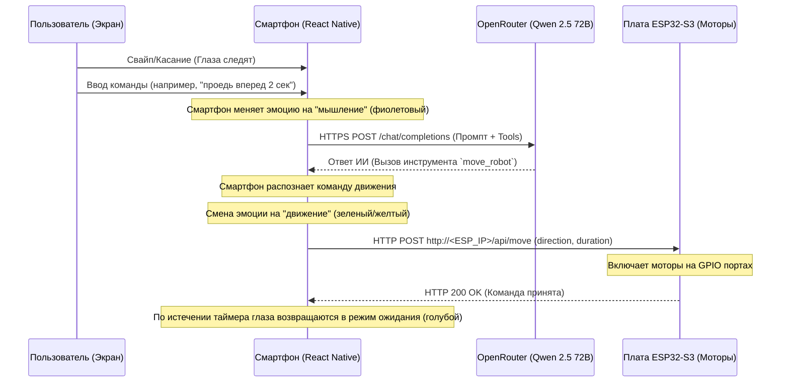

# ИИ-Робот (Edge AI Architecture MVP)

Проект интерактивного мобильного робота-компаньона (а-ля LOOI Robot). 

## Архитектура Edge AI

Робот работает по распределенной схеме, где каждый элемент выполняет свою специализированную задачу:



### 1. Смартфон (ИИ-Оркестратор, Лицо и Сенсоры)
Смартфон выступает главным вычислительным центром. 
* **Почему HTTPS-запросы к ИИ идут со смартфона, а не с ESP32?** 
  Микроконтроллеры (такие как ESP32) имеют жесткие ограничения по оперативной памяти (RAM) и вычислительной мощности. Устанавливать на них тяжелое SSL/TLS шифрование для HTTPS, парсить огромные JSON-ответы от ИИ и управлять состоянием чата неэффективно и часто приводит к сбоям. Смартфон имеет быстрый интернет, высокую производительность и готовую графическую систему для OLED-дисплея робота.
* **Функции смартфона**:
  - Принимает команды от пользователя.
  - Делает HTTPS-запрос к OpenRouter API с поддержкой Function Calling.
  - Управляет интерактивным «лицом» робота (анимации глаз, реакция на тапы, отображение мыслей в speech bubble).
  - Оркестрирует физические действия робота, посылая простые легковесные HTTP REST-запросы на ESP32-S3 в локальной сети.

### 2. Плата ESP32-S3 (Исполнитель/Железо)
Плата работает как локальный веб-сервер (REST API) в режиме исполнителя команд. Она не знает про ИИ, OpenRouter или логику общения — она просто слушает команды по Wi-Fi.
* **Функции ESP32-S3**:
  - Подключается к локальной Wi-Fi сети.
  - Поднимает HTTP-сервер на порту 80.
  - Принимает входящие POST-запросы на эндпоинт `/api/move`.
  - Управляет драйверами моторов колес (например, L298N или TB6612FNG) через GPIO пины в течение заданного времени (`duration`).

---

## Спецификация взаимодействия

### 1. Запрос от Смартфона к OpenRouter API
Смартфон отправляет промпт пользователя модели `qwen/qwen-2.5-72b-instruct` и передает описание доступных робототехнических инструментов (инструмент `move_robot`):

* **Эндпоинт**: `https://openrouter.ai/api/v1/chat/completions`
* **Формат инструментов (Tools)**:
```json
[
  {
    "type": "function",
    "function": {
      "name": "move_robot",
      "description": "Управляет физическим движением колесного робота в пространстве.",
      "parameters": {
        "type": "object",
        "properties": {
          "direction": {
            "type": "string",
            "enum": ["forward", "backward", "stop"],
            "description": "Направление движения"
          },
          "duration": {
            "type": "integer",
            "description": "Время движения робота в миллисекундах"
          }
        },
        "required": ["direction", "duration"]
      }
    }
  }
]
```

Если ИИ решает, что команда пользователя требует движения (например, *"проедь назад 3 секунды"*), он возвращает вызов функции:
```json
"tool_calls": [
  {
    "id": "call_123",
    "type": "function",
    "function": {
      "name": "move_robot",
      "arguments": "{\"direction\":\"backward\",\"duration\":3000}"
    }
  }
]
```

### 2. Запрос от Смартфона к плате ESP32-S3
Смартфон парсит ответ ИИ и отправляет локальный запрос к плате робота:

* **Эндпоинт**: `POST http://<ESP32_IP_ADDRESS>/api/move`
* **Заголовки**: `Content-Type: application/json`
* **Тело запроса (JSON)**:
```json
{
  "direction": "forward", 
  "duration": 2000
}
```
* **Параметры**:
  - `direction`: `'forward'` (ехать вперед), `'backward'` (ехать назад), `'stop'` (остановиться).
  - `duration`: целое число миллисекунд работы двигателей.

---

## Визуальные состояния лица (Глаз)

Анимация глаз на экране смартфона служит обратной связью и отражает «эмоциональное» состояние робота:

| Состояние (`eyeState`) | Цвет окантовки и зрачков | Анимация зрачка | Описание состояния |
| --- | --- | --- | --- |
| **`normal`** | Неоновый голубой (`#00F3FF`) | Стандартное слежение за пальцем, автоматическое моргание | Режим ожидания команды |
| **`thinking`** | Фиолетовый (`#AF52DE`) | Медленная пульсация (зум зрачков от 85% до 125%) | Обработка запроса ИИ-моделью |
| **`forward`** | Зеленый (`#4CD964`) | Смещены немного вперед/вверх | Робот совершает движение вперед |
| **`backward`** | Желтый (`#FFCC00`) | Смещены немного вниз | Робот пятится назад |
| **`stop`** | Красный (`#FF3B30`) | Центрированы | Экстренная остановка или сброс движения |

---

## Быстрый старт (Разработка)

### Запуск веб-версии на ПК
Для быстрого тестирования лица робота и проверки логики вызова ИИ:
1. Запусти Metro-сервер с очисткой кэша:
   ```bash
   npx expo start --web --port 8085 --clear
   ```
2. Открой в браузере `http://localhost:8085` (желательно в режиме инкогнито).
3. Нажми `⚙` в правом нижнем углу, введи свой API-ключ OpenRouter и тестируй логику прямо через консоль отладки.

*Подробная инструкция по сборке готового `.apk` файла для установки на смартфон лежит в файле [DOCS.md](DOCS.md).*
